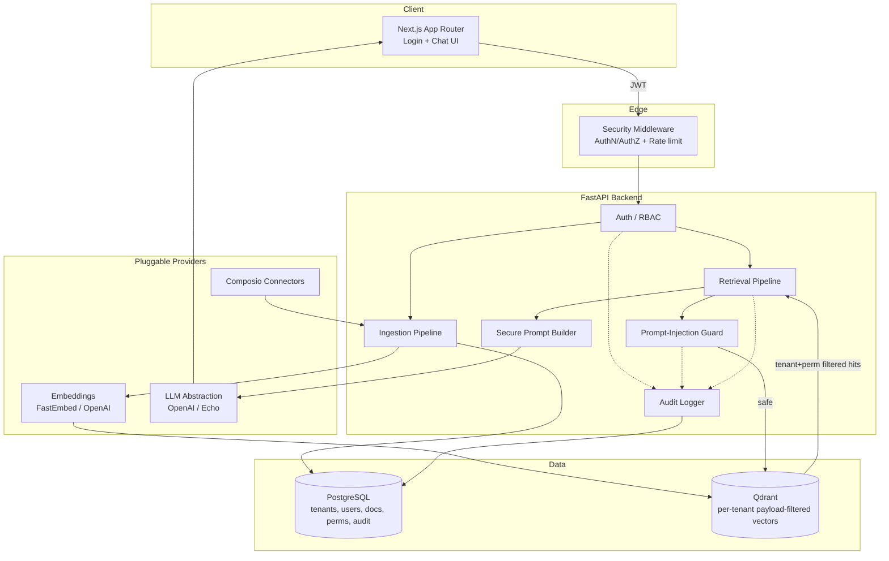
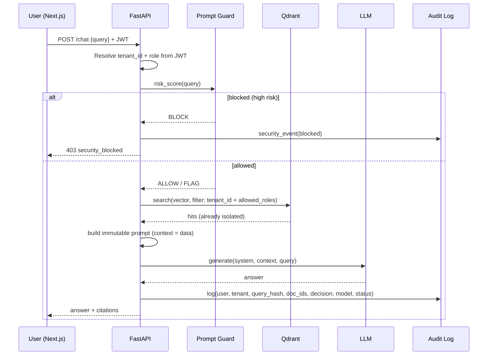
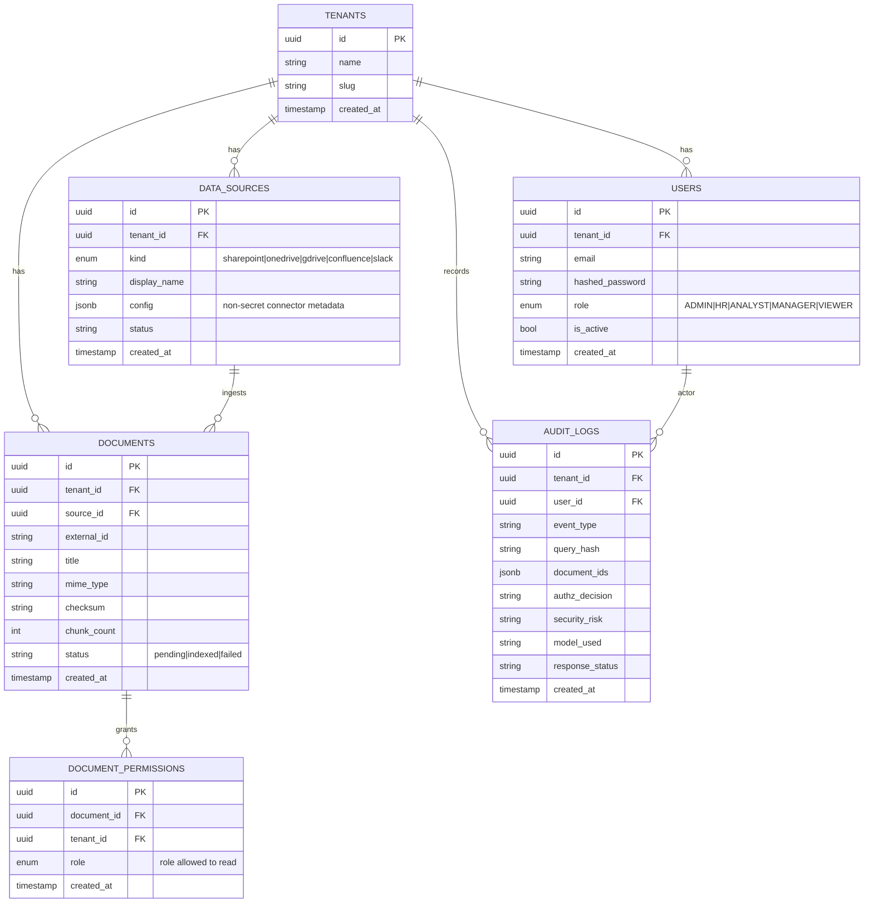

# Secured Enterprise RAG Platform

A production-oriented, **multi-tenant**, **secure** Retrieval-Augmented Generation (RAG)
platform. Companies connect data sources (SharePoint, OneDrive, Google Drive, Confluence,
Slack via Composio), ingest documents, and query their knowledge base through a chat
interface with **source citations** — under strict tenant isolation, RBAC, prompt-injection
defense, secure prompt construction, and PII-aware audit logging.

> This repo is a **secure-by-design MVP**: minimal but complete code paths for every
> required capability. It favors security, tenant isolation, maintainability, and
> scalability over feature breadth.

---

## 1. High-level Architecture



### Request flow for a chat query



---

## 2. Database Schema

PostgreSQL is the system-of-record for identity, documents metadata, permissions, and audit.
Vectors live in Qdrant; **no chunk text is stored in Postgres or logs**.



### RBAC matrix (default)

| Capability                  | ADMIN | HR | ANALYST | MANAGER | VIEWER |
|-----------------------------|:-----:|:--:|:-------:|:-------:|:------:|
| Manage users / tenant       | ✅    | ❌ | ❌      | ❌      | ❌     |
| Connect data sources        | ✅    | ✅ | ❌      | ✅      | ❌     |
| Trigger ingestion           | ✅    | ✅ | ❌      | ✅      | ❌     |
| Set document permissions    | ✅    | ✅ | ❌      | ✅      | ❌     |
| Query chat / retrieve       | ✅    | ✅ | ✅      | ✅      | ✅     |
| Read audit logs             | ✅    | ❌ | ❌      | ❌      | ❌     |

Document-level read access = **role membership in the document's `DOCUMENT_PERMISSIONS`**.
ADMIN role implicitly reads all tenant documents.

---

## 3. Backend Folder Structure

```
backend/
├── Dockerfile
├── pyproject.toml            # uv-managed dependencies
├── uv.lock                   # pinned, reproducible lockfile
└── app/
    ├── main.py                # FastAPI app, middleware, router wiring, startup
    ├── config.py              # Pydantic settings (env-driven, pluggable providers)
    ├── db.py                  # SQLAlchemy engine/session, create_all
    ├── models.py              # ORM: Tenant, User, DataSource, Document, DocumentPermission, AuditLog
    ├── schemas.py             # Pydantic request/response DTOs
    ├── security/
    │   ├── auth.py            # password hashing, JWT issue/verify, current_user dep
    │   ├── rbac.py            # Role enum, capability checks, require_role dep
    │   ├── prompt_guard.py    # prompt-injection / jailbreak risk scoring
    │   └── pii.py             # PII detection + masking for logs
    ├── audit/
    │   └── logger.py          # structured, PII-safe audit logging to Postgres
    ├── embeddings/
    │   ├── base.py            # EmbeddingProvider interface
    │   ├── fastembed_provider.py
    │   └── openai_provider.py
    ├── llm/
    │   ├── base.py            # LLMProvider interface
    │   ├── openai_provider.py
    │   └── echo_provider.py   # zero-dependency fallback for local dev
    ├── vector/
    │   └── qdrant_store.py    # collection design + tenant/permission-filtered search
    ├── connectors/
    │   ├── base.py            # Connector interface (list + fetch documents)
    │   └── composio_connector.py
    ├── ingestion/
    │   ├── extractor.py       # raw bytes/text -> normalized text
    │   ├── chunker.py         # token-aware chunking with overlap
    │   └── pipeline.py        # extract -> chunk -> embed -> upsert + metadata
    ├── retrieval/
    │   └── pipeline.py        # guard -> filtered search -> prompt -> LLM -> citations
    ├── prompts/
    │   └── templates.py       # immutable system prompt + fixed slots
    └── api/
        ├── deps.py            # shared dependencies (db, current_user, tenant)
        └── routes/
            ├── auth.py        # register tenant/admin, login
            ├── documents.py   # upload/ingest, list, set permissions
            ├── connectors.py  # register + sync data sources
            ├── chat.py        # secure query endpoint
            └── admin.py       # audit log access (ADMIN only)
```

---

## 4. Frontend Folder Structure

```
frontend/
├── Dockerfile
├── package.json
├── next.config.js
├── tsconfig.json
├── lib/
│   └── api.ts                 # typed fetch wrapper, JWT in memory/localStorage
└── app/
    ├── layout.tsx
    ├── page.tsx               # redirect -> /login or /chat
    ├── login/page.tsx         # email/password login
    └── chat/page.tsx          # chat UI with streamed answer + citations
```

---

## 5. FastAPI Implementation Plan

1. **Settings** (`config.py`): all secrets and provider selection via env. `EMBEDDING_PROVIDER`,
   `LLM_PROVIDER` switch implementations at startup with no code changes.
2. **DB layer**: SQLAlchemy 2.0 models + session dependency. `create_all` for MVP (Alembic in roadmap).
3. **Auth**: `/auth/register` bootstraps a tenant + admin; `/auth/login` issues a JWT carrying
   `sub`, `tenant_id`, `role`. Every protected route resolves `current_user` and **never trusts a
   client-supplied tenant_id**.
4. **RBAC**: `require_role(...)` dependency gates write/admin endpoints; retrieval gates by
   document permissions.
5. **Security middleware**: attaches request id, enforces auth, and runs the prompt guard on chat.
6. **Ingestion**: connectors/upload → extract → chunk → embed → Qdrant upsert (payload carries
   `tenant_id`, `document_id`, `allowed_roles`) + Postgres metadata.
7. **Retrieval**: guard → embed query → Qdrant search **with a mandatory tenant+role filter** →
   secure prompt → LLM → response with citation doc IDs.
8. **Audit**: every sensitive action writes a PII-safe audit row.

---

## 6. Qdrant Indexing Strategy

- **One collection per deployment**, `rag_chunks`, with strong payload-based isolation
  (simpler ops, cheaper than collection-per-tenant for an MVP; collection-per-tenant is a
  drop-in scaling option later).
- Vector params derived from the active embedding provider (`size`, `distance=COSINE`).
- **Payload indexes** on `tenant_id` (keyword) and `allowed_roles` (keyword) for fast filtering.
- **Every** search passes a `Filter` with `must: tenant_id == <jwt tenant>` and
  `should/must: allowed_roles ∈ <caller role + ADMIN-any>`. The filter is constructed
  server-side from the JWT — a client can never widen it.
- Point payload: `{ tenant_id, document_id, source_id, allowed_roles[], chunk_index, title, text }`.
  `text` is stored for citation snippet rendering but **never logged**.

---

## 7. RBAC Implementation Details

- Roles: `ADMIN, HR, ANALYST, MANAGER, VIEWER` (`security/rbac.py`).
- **Tenant isolation** is enforced at three layers: (1) JWT-derived `tenant_id` on every query,
  (2) SQL queries always filter `tenant_id`, (3) Qdrant filter always pins `tenant_id`.
- **Document-level permissions**: `DOCUMENT_PERMISSIONS(document_id, role)`. A document is
  retrievable if the caller's role is in its `allowed_roles` (ADMIN bypasses).
- Capability checks (`require_role`) protect management endpoints.

---

## 8. Prompt-Injection Detection

`security/prompt_guard.py` scores each query 0–100 across weighted signal categories:
instruction override, role manipulation, jailbreak patterns, data exfiltration, hidden/encoded
instructions, and suspicious keywords. Thresholds → `ALLOW` / `FLAG` / `BLOCK`. Every non-allow
decision emits a security audit event. Context retrieved from documents is **always** treated as
data, never instructions (enforced in the prompt template).

---

## 9. Audit Logging Module

`audit/logger.py` writes structured rows containing only: user id, tenant id, timestamp,
**query masking** (never raw query), retrieved **document IDs only**, authorization decision,
security risk, model used, and response status. PII (emails, phones, bank/card numbers) is
masked via `security/pii.py` before anything is persisted. Full prompts, chunk text, and raw
documents are never logged.

---

## 10. Docker Compose

`docker-compose.yml` brings up `postgres`, `qdrant`, `backend` (FastAPI/uvicorn), and
`frontend` (Next.js). Copy `.env.example` → `.env` and run `docker compose up --build`.
Backend: http://localhost:8000/docs · Frontend: http://localhost:3000.

---

## 11. Development Roadmap

1. **MVP (this repo)**: auth, tenant isolation, RBAC, ingestion (upload), payload-filtered
   retrieval, prompt guard, secure prompts, PII-safe audit, Docker.
2. **Connectors**: wire real Composio OAuth + incremental sync per source.
3. **Migrations**: replace `create_all` with Alembic; add indexes/constraints.
4. **Hardening**: rate limiting, refresh tokens, secret manager, mTLS to Qdrant, RLS in Postgres.
5. **Scale**: collection-per-tenant option, async ingestion workers (Celery/RQ), reranking.
6. **Observability**: OpenTelemetry traces, metrics, SIEM export of audit events.
7. **Compliance**: data residency, retention policies, right-to-erasure tooling.

---

## Quickstart

```bash
cp .env.example .env
docker compose up --build
# Register a tenant + admin, then log in from the frontend.
```
